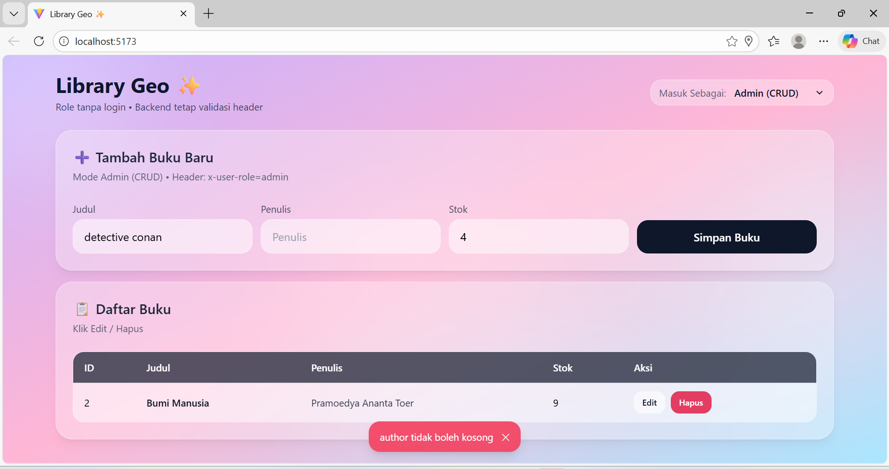
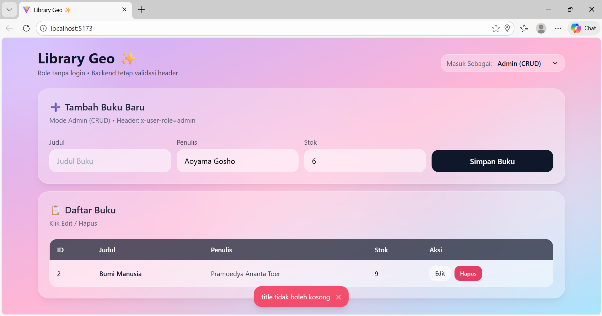

# Library Geo 📚✨
Backend sederhana manajemen perpustakaan dengan fitur peminjaman berbasis lokasi (geolocation).  
Autentikasi **tanpa JWT**, role disimulasikan menggunakan **HTTP Header** sesuai instruksi tugas.

## ✨ Fitur Utama
- **Public**
  - Melihat daftar buku
  - Melihat detail buku
- **Admin (x-user-role: admin)**
  - Tambah buku
  - Update buku
  - Hapus buku
- **User (x-user-role: user & x-user-id)**
  - Meminjam buku + menyimpan **latitude & longitude**
  - Stok buku otomatis berkurang saat dipinjam

---

## 🧰 Tech Stack
- **Backend:** Node.js, Express.js
- **Database:** MySQL + Sequelize ORM
- **Frontend:** React (Vite) + TailwindCSS

---

## 📦 Struktur Database
### Tabel `books`
Kolom: `id`, `title`, `author`, `stock`

### Tabel `borrow_logs`
Kolom: `id`, `user_id`, `book_id`, `borrow_date`, `latitude`, `longitude`, `created_at`, `updated_at`

> Catatan: tabel `SequelizeMeta` dibuat otomatis oleh sequelize untuk tracking migration.

---

## ⚙️ Cara Menjalankan Aplikasi

### 1) Persiapan Database (MySQL)
1. Buka MySQL Workbench
2. Buat database kosong (schema), contoh: `library_geo`
   ```sql
   CREATE DATABASE library_geo;
   ```
3. Pastikan konfigurasi database di backend sudah sesuai (file `.env`), contoh:
   ```env
   DB_HOST=localhost
   DB_USER=root
   DB_NAME=library_geo
   DB_PORT=3306
   PORT=3000
   ```

### 2) Menjalankan Backend
Masuk ke folder backend:
```bash
npm install
npm run db:migrate
npm run dev
```

Backend berjalan di:
- `http://localhost:3000`

### 3) Menjalankan Frontend
Buka terminal baru:
```bash
cd frontend
npm install
npm run dev
```

Frontend berjalan di:
- `http://localhost:5173`

---

## 🧪 Testing Endpoint API (Postman)

### Public
- `GET /api/books` → melihat semua buku  
- `GET /api/books/:id` → detail buku

### Admin (Header wajib)
Headers:
- `x-user-role: admin`

Endpoints:
- `POST /api/books`
- `PUT /api/books/:id`
- `DELETE /api/books/:id`

### User (Header wajib)
Headers:
- `x-user-role: user`
- `x-user-id: 10` (contoh)

Endpoint:
- `POST /api/borrow`

Body payload contoh:
```json
{
  "bookId": 1,
  "latitude": -6.2088,
  "longitude": 106.8456
}
```

Business Logic:
- Stok buku berkurang
- Data peminjaman tersimpan di tabel `borrow_logs` beserta koordinat

---

## ✅ Screenshot Hasil Aplikasi

> Semua screenshot ada di folder: `ss/`

### A) Tampilan Web
**Public Mode**  


**User Mode**  


**Admin Mode**  


---

### B) Test Endpoint API (Postman)
**GET semua buku**  


**GET detail buku**  


**POST tambah buku (Admin)**  
  
.png)

**PUT update buku (Admin)**  


**DELETE buku (Admin)**  
  


**POST pinjam buku (User)**  
  
  


---

### C) Struktur Database (MySQL Workbench)
**Borrow Logs (bukti lokasi tersimpan)**  


---

### D) Bukti Stok Berkurang
**Sebelum pinjam**  


**Setelah pinjam**  


---

## 🧾 Validasi Sederhana
- `title` dan `author` tidak boleh kosong (backend).  
Bukti validasi:  
  

